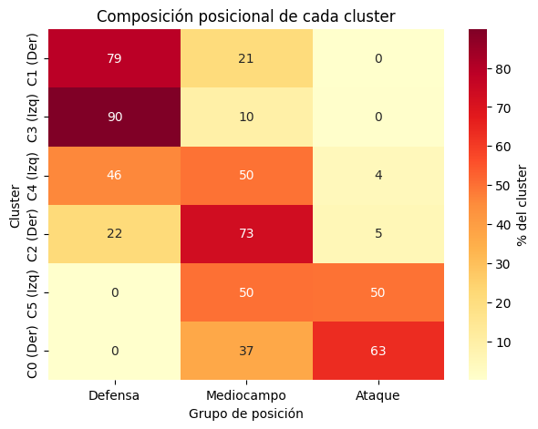
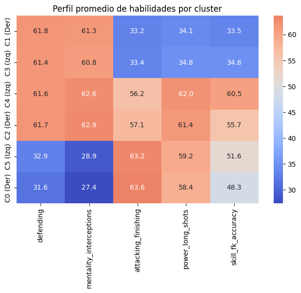
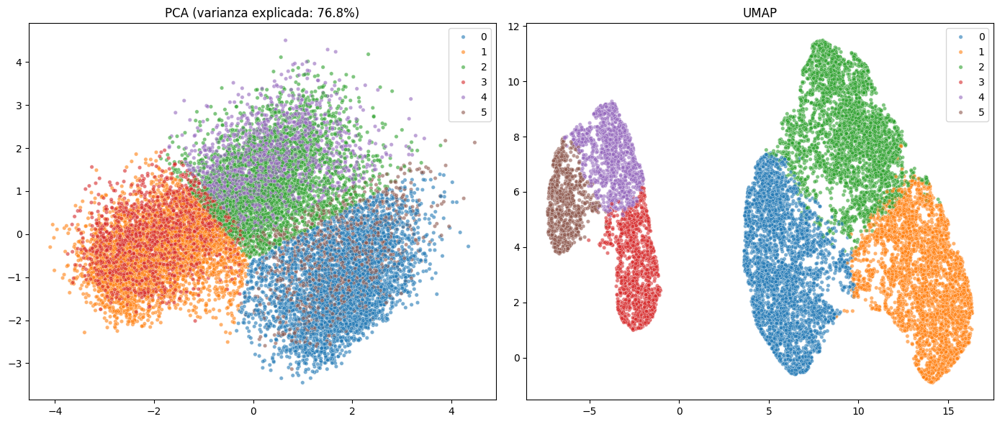

# Clustering de jugadores — EA Sports FC 24

Trabajo práctico realizado en el marco de la **Diplomatura en Ciencia de Datos, Aprendizaje Automático y sus Aplicaciones** (Edición 2026) — materia *Aprendizaje No Supervisado*.

Se busca encontrar grupos de jugadores de fútbol con habilidades equivalentes a partir del dataset [EA Sports FC 24 Complete Player Dataset](https://www.kaggle.com/datasets/stefanoleone992/ea-sports-fc-24-complete-player-dataset) (Kaggle), con un objetivo concreto: dado un plantel, **¿por quién se reemplaza a un jugador lesionado o cansado?**

## Autores

Grupo 14:
- María José Kanagusuku
- Nicolás Uriel Mansutti
- Rafael Andrés Pignata
- María Valeria Sieyra

## Fuente de datos

[EA Sports FC 24 Complete Player Dataset](https://www.kaggle.com/datasets/stefanoleone992/ea-sports-fc-24-complete-player-dataset?select=male_players.csv) — 180.021 filas × 109 columnas, con estadísticas de jugadores a lo largo de varias versiones del juego (FIFA 15 a FC 24).

## Metodología

1. **Análisis exploratorio y limpieza:** detección de duplicados (un mismo jugador aparece en varias versiones del juego), separación de arqueros vs. jugadores de campo (los NaN en atributos ofensivos/defensivos no son datos faltantes, sino que esos atributos no aplican a arqueros), y selección de atributos relevantes para el objetivo.
2. **Exploración visual bivariada:** pairplots por familia de atributos (ataque, defensa, mentalidad, potencia, habilidad), buscando variables con distribución bimodal — señal de que podrían separar bien los clusters.
3. **Selección de atributos para clustering:** conjunto mixto de 6 variables (`defending`, `mentality_interceptions`, `attacking_finishing`, `power_long_shots`, `skill_fk_accuracy`, `preferred_foot_enc`), estandarizadas con `StandardScaler`.
4. **Dos algoritmos de clustering, con lógicas opuestas:**
   - **K-Means:** particiona el espacio en base a centroides; se barrieron valores de k entre 2 y 10 usando inercia (codo) y silhouette score.
   - **HDBSCAN:** basado en densidad, no asume forma esférica ni número de clusters fijo; se hizo búsqueda de hiperparámetros (`min_cluster_size`, `min_samples`, `cluster_selection_method`).
5. **Reducción de dimensionalidad para visualizar:** PCA vs. UMAP, comparadas cuantitativamente por silhouette score sobre la proyección 2D.

## Principales hallazgos

**La estructura real es de 3 arquetipos, no 6.** El heatmap de composición posicional y el de perfil de habilidades por cluster muestran que K-Means (k=6) en realidad encontró **3 perfiles futbolísticos (defensivo / mixto / ofensivo), cada uno duplicado por pie preferido**:




**HDBSCAN confirmó la misma estructura de fondo, con matices.** Con el método de selección por defecto (`eom`), convergió sistemáticamente a 2 clusters (silhouette 0.24) en 25 combinaciones de hiperparámetros distintas. Cambiando a selección `leaf` aparecieron hasta 5-7 clusters con silhouette de hasta 0.58 — pero clasificando como "ruido" entre el 69% y el 77% de los jugadores, lo que invalida esa métrica como criterio de comparación justo.

**UMAP separa los clusters visual y cuantitativamente mejor que PCA:** silhouette de 0.462 (UMAP) vs. 0.362 (PCA) vs. 0.361 (datos originales sin reducir).



## Comparación con LLMs: interpretación humana vs. automática

Como ejercicio adicional, se presentó a **ChatGPT, Gemini y Claude** la misma información objetiva del análisis (tabla de centroides, tamaños de cluster, variables usadas) — sin la interpretación propia del grupo — y se les pidió que interpretaran los clusters de forma independiente.

**Resultado:** los tres modelos llegaron, sin verse entre sí, a la misma lectura de fondo que el grupo había construido con heatmaps y proyecciones: **3 perfiles de habilidad duplicados por pie preferido**. Los tres también coincidieron en un matiz importante que el grupo ya había señalado: el centroide es un promedio, no garantiza que los jugadores dentro de un cluster sean intercambiables en la práctica, y la heterogeneidad interna se explica por variables no incluidas en el clustering (pace, passing, físico, etc.).

Este ejercicio no midió si los LLMs "acertaron" (ya conocían la respuesta esperada, no fue un test ciego), sino si podían **razonar correctamente a partir de estadística descriptiva pura** — y los tres lo hicieron con un nivel de detalle comparable al del propio análisis humano, lo cual invita a pensar en qué medida el análisis exploratorio manual sigue siendo insustituible y en qué medida puede apoyarse en estas herramientas.

## De cluster a herramienta: `sugerir_reemplazos()`

Para cerrar el círculo con la pregunta original del trabajo, se implementó una función que, dado el nombre de un jugador, sugiere reemplazos concretos:

1. Ubica al jugador y su cluster (mismo perfil de habilidad).
2. Dentro de ese cluster, prioriza candidatos con edad y *overall* similares.
3. Da prioridad adicional a jugadores del mismo club.

```python
sugerir_reemplazos('Füllkrug', df_perfil, n=5)
```

Convierte el resultado del clustering en algo directamente accionable, más allá del análisis exploratorio.

## Herramientas y metodología

- **Análisis y limpieza:** `pandas`, `numpy`.
- **Clustering:** `scikit-learn` (`KMeans`, `StandardScaler`, `silhouette_score`), `hdbscan`.
- **Reducción de dimensionalidad:** `scikit-learn` (`PCA`), `umap-learn`.
- **Visualización:** `matplotlib`, `seaborn`.

## Estructura del repositorio

```
.
├── README.md
├── notebook.ipynb
├── requirements.txt
└── images/
    ├── composicion_posicional_clusters.png
    ├── perfil_habilidades_clusters.png
    └── pca_vs_umap.png
```

## Cómo reproducirlo

```bash
pip install -r requirements.txt
jupyter notebook notebook.ipynb
```

> El dataset (`male_players.csv`) debe descargarse manualmente desde [Kaggle](https://www.kaggle.com/datasets/stefanoleone992/ea-sports-fc-24-complete-player-dataset?select=male_players.csv) (requiere cuenta) y colocarse en el mismo directorio que el notebook, dado su tamaño y los términos de la licencia de Kaggle.
